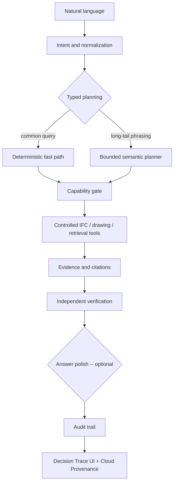

# ARMIE Construction Intelligence Workbench

[](https://armiem3-web.thankfulcliff-c5f74fed.eastus2.azurecontainerapps.io)
[](https://claude.ai/code/artifact/9ab51d68-226b-411b-8810-15f2d826dee3)

A cloud-native, auditable multimodal AI reference platform for turning fragmented construction
information -- BIM models, engineering drawings, schedules, and viewer screenshots -- into
verified, evidenced answers with typed planning, controlled execution, independent verification,
and a full audit trail. Runs two ways from the same codebase: **fully local** (Ollama, one
synthetic project) for a zero-cost walkthrough, or **fully deployed on Azure** (Container Apps,
Azure OpenAI, Azure AI Search, PostgreSQL, ADLS Gen2, Blob Storage, Application Insights, all
behind Managed Identity) for a real multi-project, multi-document, cloud-native slice.

This is an independent ARMIE AI Labs reference implementation. It is not a production SaaS,
compliance engine, unrestricted BIM reasoning system, or multi-tenant platform -- see
[Known limitations](#known-limitations) for exactly where the line is drawn.


*Public synthetic demo: interactive BIM viewer, conversational workspace, and the Decision Trace
panel -- plan, execution, evidence, verification, and cloud provenance for every answer, laid out
step by step.*

## Try it now

**[Launch the live Azure demo →](https://armiem3-web.thankfulcliff-c5f74fed.eastus2.azurecontainerapps.io)**
(ask the project owner for the access key) -- or open the
**[Demo Playbook](https://claude.ai/code/artifact/9ab51d68-226b-411b-8810-15f2d826dee3)** for a
guided, scenario-by-scenario walkthrough with a pre-flight checklist and an index of "if they ask
this, run that."

A handful of scenarios to try immediately, no setup required, on the **ARMIE Demo Project**:

| Ask | What it demonstrates |
|---|---|
| `How many doors are in the project?` | Deterministic IFC computation, zero model calls, full audit trail |
| `What is the connected load for DB-L1-A?` | Deterministic PDF table extraction, cited evidence crop |
| `Reconcile the doors and windows between the model and the schedule.` | Cross-source IFC↔drawing reconciliation joined on a shared identifier |
| `What is the connected load for Panel-B?` | An honest precision refusal -- the same field genuinely exists in two documents, and the system says so instead of guessing |
| `What is the connected load for Panel-E?` | Azure AI Search hybrid retrieval directing an honest miss to the most relevant document, with the full relevance table one click away |

Switch the **Project** selector to **Westgate Distribution Center** to see the same corpus of
capabilities running against an independently isolated second project -- different IFC, different
documents, same shared board names resolving to different values, proving one project's data can
never leak into another's answer.

## Two ways to run this

### Azure profile (the live demo above)

The deployed slice is a real, currently-running Azure environment, not a diagram:

- **Compute** -- React/Vite web app and FastAPI+LangGraph API as two separate Azure Container
  Apps (the API is internal-only), built and pushed through Azure Container Registry, deployed
  via Bicep IaC and a manual (`workflow_dispatch`) GitHub Actions pipeline.
- **AI** -- Azure OpenAI (Managed Identity, no API keys anywhere in the codebase or infra),
  Azure AI Search hybrid (BM25 + `text-embedding-3-small`) retrieval as a directed-miss fallback
  behind deterministic extraction, and an opt-in final answer-wording polish pass with a
  code-level guard that can only change phrasing, never a number.
- **Data** -- Azure Database for PostgreSQL (conversation/audit persistence, survives a Container
  App revision replacement), Azure Blob Storage (evidence crop persistence), and Azure Data Lake
  Storage Gen2 for real multi-project source isolation -- two independent projects, each with its
  own IFC/PDF corpus, directory-level POSIX ACLs, and a frozen `source_set_id` provenance record
  per project.
- **Security** -- separate Managed Identities for the web and API apps, least-privilege RBAC,
  a shared-secret gate on the public API (see [Known limitations](#known-limitations) for what
  this does and does not authenticate), per-caller and global rate limiting.
- **Observability** -- OpenTelemetry → Application Insights, a full per-request Decision Trace
  (plan → execution → evidence → verification → result, each step's own latency and raw audit
  events one click away), and a one-click **Cloud Provenance** link from any answer straight into
  that request's own Application Insights telemetry.

Every one of these is opt-in-when-unset in `apps/api/app/config.py`: the identical codebase runs
with none of them configured (the local profile below) or all of them (the live demo).

### Local profile (zero cost, one synthetic project)

Requirements: Python 3.9+, Node.js 18+, a modern browser, and Ollama with enough memory for the
local models.

```bash
cp .env.example .env
ollama pull qwen3:8b
ollama pull qwen3-vl:8b

python3 -m venv .venv
source .venv/bin/activate
pip install -e 'apps/api[dev]'

PYTHONPATH=apps/api python3 -m uvicorn app.main:app --host 127.0.0.1 --port 8000
```

In another terminal:

```bash
cd apps/web
npm install
npm run dev
```

Use `npm ci` instead of `npm install` for a reproducible install from the committed lockfile
(this is what CI runs; both work with no flags -- see `docs/decisions/README.md` D-006). Open the
URL printed by Vite, normally `http://127.0.0.1:5173`.

`./scripts/dev.sh` starts both servers together and stops both on Ctrl+C.

Deploying your own Azure copy: see `docs/specs/SPEC-M3-azure-vertical-slice-v1.md` for the base
slice and `.github/workflows/azure-deploy.yml` for every opt-in setting (multi-project ADLS,
Azure AI Search, rate limits, answer polish, the Application Insights deep link) -- all wired
through `infra/bicep/apps.bicep` with no manual portal configuration required.

## Architecture



LLMs interpret intent, help construct bounded plans, and -- only when explicitly enabled -- reword
an already-verified answer for tone. Python and IfcOpenShell calculate every engineering fact.
Vision models interpret drawing or viewer pixels as a bounded fallback; they never replace
structured IFC computation, and a code-level guard rejects any answer-polish rewrite that changes
even one number.

## Design principles

- One typed `QueryPlan`/`MultiQueryPlan` contract for heuristic and semantic planning, across
  every source (IFC, PDF, retrieval, reconciliation).
- Capability gates reject unsupported operations before tools run.
- Deterministic IFC counts, grouping, bounded quantity aggregation, and cross-source
  reconciliation -- the LLM is never the arithmetic.
- Evidence-first answers, with the exact source, page, region, or IFC identity, and (on Azure)
  which project and frozen source version produced it.
- Independent verification rather than trusting the answer generator; an optional final
  wording pass is verified never to have touched a value, not merely instructed not to.
- Honest clarification, unsupported, and refused dispositions -- including an explicit
  precision-vs-recall distinction when a field is ambiguous versus genuinely not found.
- Request IDs, deadlines, cancellation, per-caller and global rate limiting, and a trace ID that
  is the same one an operator would use to look up the request's own cloud telemetry.

| Responsibility | System |
|---|---|
| Natural-language interpretation | Rules plus bounded LLM (Ollama locally, Azure OpenAI on the Azure profile) |
| Query planning | Deterministic parser plus semantic text planner |
| IFC fact computation | IfcOpenShell and Python |
| Drawing interpretation | Deterministic row/column extraction first; vision model as bounded fallback |
| Document-location retrieval | Azure AI Search hybrid (BM25 + embeddings), opt-in, informational only |
| Evidence construction | Application runtime, Azure Blob-persisted when configured |
| Verification | Deterministic and independent validation |
| Answer wording | Optional final polish pass, guarded to never change a value |
| Final presentation | React workbench -- Decision Trace panel |
| Observability | OpenTelemetry, Application Insights, per-request Cloud Provenance link |

## Public demo workspace

The repository includes only synthetic assets in `demo_data/`:

- `armie_demo.ifc` / `demo_data/westgate/`: two independently-isolated project fixtures, each a
  BIM model with walls, doors, windows, storey containment, and controlled heights.
- `armie_demo_schedule.pdf` plus an 18-document synthetic corpus (`demo_data/corpus/`): schedules,
  door/window spec sheets, RFI logs, and meeting-minutes excerpts, covering both a genuine
  precision collision (the same field answerable from more than one document) and a genuine
  recall failure (an answer that exists only under vocabulary no table uses).

The workbench has three source modes -- BIM Model, Engineering Drawing, and Viewer Snapshot --
plus a Project selector when more than one project is configured. The Decision Trace panel shows
how every answer was produced, from the question as understood through to independent
verification and (on Azure) the cloud telemetry behind it.

## Visual walkthrough

The following screenshots were captured locally from the synthetic public fixtures in `demo_data/`.


*A typed IFC query returns a data-derived result with element citations and independent verification.*


*The drawing workflow routes a synthetic schedule question to document analysis and keeps the source page visible alongside the answer.*


*The Decision Trace panel makes planning, execution, evidence, verification, and the final disposition inspectable, step by step.*

## Supported capabilities

- Project and per-level door/window counts, grouped counts by storey, and bounded
  maximum-height aggregation.
- Deterministic multi-document schedule/field lookup, with vision as a bounded fallback and Azure
  AI Search as an opt-in retrieval-directed miss (see "Known limitations" for the generality
  caveat on the extractor itself).
- Real multi-project workspaces on the Azure profile: independent IFC/PDF corpora, isolated by
  Azure Data Lake Storage Gen2 directory ACLs, with per-project frozen source-version provenance
  surfaced on every citation and audit event.
- Current-view screenshot inspection with honest target-visibility handling.
- Short-term conversational context, clarification, unsupported-operation handling, citations,
  and independent verification.
- Narrow, explicitly scoped IFC↔drawing cross-source reconciliation: door and window quantities
  checked against a drawing schedule, joined on each element's `Tag`, reporting per-item matches,
  dimension mismatches, and omissions on either side (see "Known limitations" for what remains
  out of scope).
- Optional answer-wording polish: a final model call may reword an already-computed answer for
  tone, gated by a code-level check that rejects any rewrite whose set of numbers doesn't
  exactly match the original -- off by default, opt-in per deployment.

One thread is bound to exactly one project for its lifetime; there is no cross-project query,
arbitrary property language, nearest-room search, compliance reasoning, or autonomous geometry
exploration. Cross-source reconciliation always compares only door/window width and height,
regardless of what attribute a question names; see "Known limitations" for how its routing
trigger is actually scoped.

## Evaluation

```bash
PYTHONPATH=apps/api python3 -m pytest -q
cd apps/web && npm run build
```

295 tests run against the public synthetic fixtures, covering: deterministic-contract tests for
the router/plan-validation/verification modules; provider failure-path evals driven by a fake,
no-network provider; deterministic document-extraction tests across every board/field combination
plus ambiguity, vision-fallback, and bbox-plausibility paths; an explicit disposition-taxonomy
contract suite; cross-source reconciliation's ground truth, detector precision, and fixture
isolation; multi-project ADLS opt-in/download/concurrency/failure-contract tests, including a
real thread-pool race; the Azure AI Search retrieval seam; per-caller and global rate limiting;
the answer-polish number-preservation guard's full truth table; and the Cloud Provenance
Application Insights link's span-tagging, proven via a real HTTP request against a recording-span
double, not just a unit check on the URL-building helper. CI runs the full suite on Python
3.9-3.12 (`.github/workflows/ci.yml`); see `docs/specs/` (one file per milestone, M1 through M10)
for the full test inventory and `docs/decisions/README.md` for every fix's own verification
account. Azure-specific behavior (real deployment, real Azure OpenAI/Search/ADLS/Application
Insights) is additionally verified against the live subscription on every deploy via
`azure-deploy.yml`'s own post-deploy smoke tests, and by hand -- see `docs/reports/` for the
dated deployment-baseline reports and `docs/decisions/README.md`'s D-024 through D-031 for live
fixes found and verified directly against production.

## Privacy and data

This public repository contains no original recruitment, customer, or proprietary project data.
Demo assets are synthetic and generated by `scripts/generate_demo_data.py`. Do not add supplied
IFC/PDF files, evidence crops, screenshots, model caches, runtime traces, secrets, or private
paths.

## Known limitations

- Validated demo language is English (and Chinese for a subset of natural-language phrasing
  paths); other languages and noisy input are experimental.
- The IFC query surface is intentionally bounded, not an unrestricted property language.
- Visual conclusions depend on the captured view and may require clarification.
- Document field lookup is deterministic-first, with vision as a genuine fallback rather than
  the primary path. The deterministic extractor uses tolerance-based row/column clustering
  characterized against the committed synthetic schedules' layout -- **not** a general
  table-extraction capability: it is not claimed to work on an arbitrary drawing, a scanned/
  OCR-required document, or a ruled-line table.
- Cross-source reconciliation is limited to one explicitly scoped case (door/window quantities
  against a drawing schedule); no general IFC/PDF cross-source join capability or compliance
  engine. Its routing trigger is keyword-level, not semantic understanding of the requested
  attribute.
- One project per conversation thread for its lifetime; no cross-project query or arbitrary
  multi-tenant data model.
- The public API is protected by a shared secret, not an enterprise identity provider -- this
  authenticates possession of the secret, not per-user identity or per-project authorization.
  Entra ID-backed, project-scoped authorization is a natural next step, not yet built.
- Single Container App replica per app (`app.state.requests`' live cancellation-task references
  and the in-process rate limiter both assume this); no distributed worker/queue architecture.
  This is a deliberate, documented boundary (`docs/decisions/REVIEW_REQUIRED.md`), not an
  oversight, and is the right next architectural question before considering a scale-out
  platform like AKS -- not something Kubernetes alone would resolve.
- No multi-tenancy, enterprise SLOs, or large-scale throughput claim; the Azure profile is a
  real but small-scale reference deployment, not a load-tested production system.
- No autonomous camera planning or arbitrary geometry reasoning.

## Roadmap

Ideas under active evaluation, not commitments: promoting a reconciliation finding into a typed,
human-reviewable business object (accept/reject a discrepancy, not just report it); revision-aware
source governance (a superseded document should not be citable as authoritative); an explicit
data-readiness/quality gate ahead of automation; Entra ID-backed per-project authorization; and a
generalized connector abstraction over today's local-filesystem/ADLS source registry. See
`docs/decisions/REVIEW_REQUIRED.md` and `docs/decisions/README.md` for every currently-tracked
gap and the reasoning behind each milestone's own scope boundary.

## ARMIE AI Labs

ARMIE AI Labs · AI Systems Architecture · Retrieval · Agents · Evaluation · Production AI

https://armieai.com/
