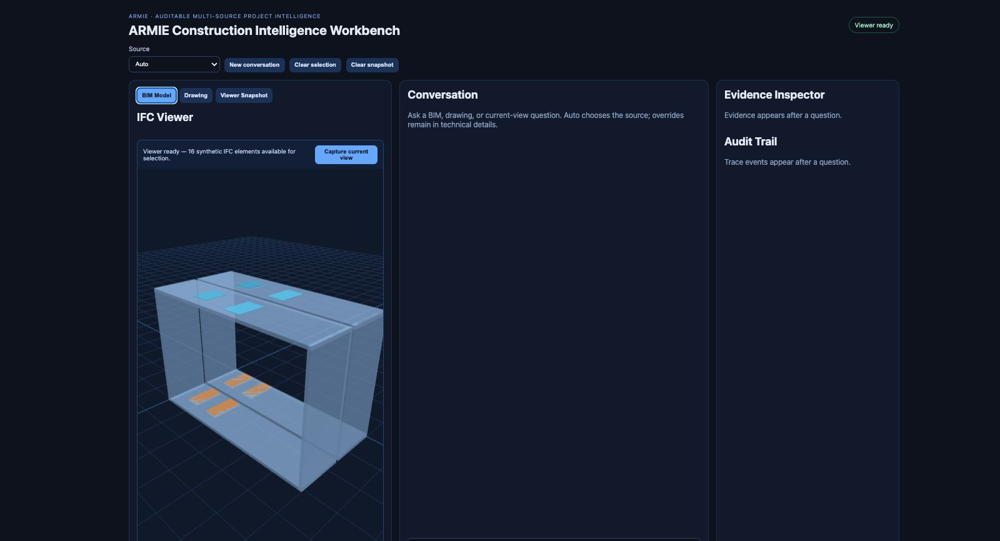
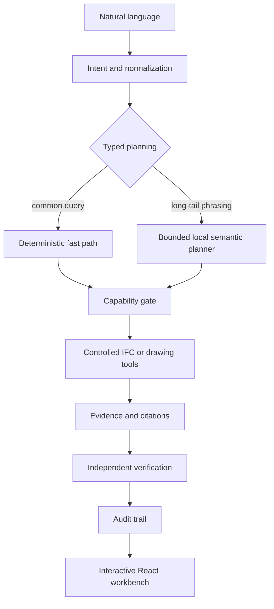
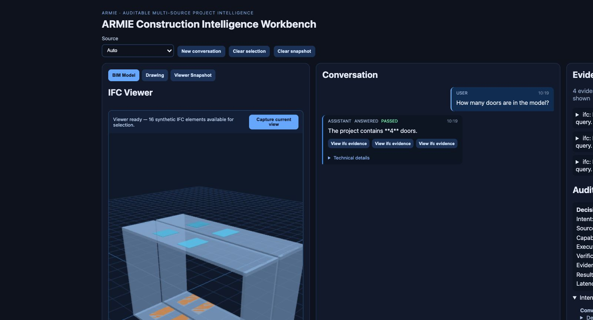
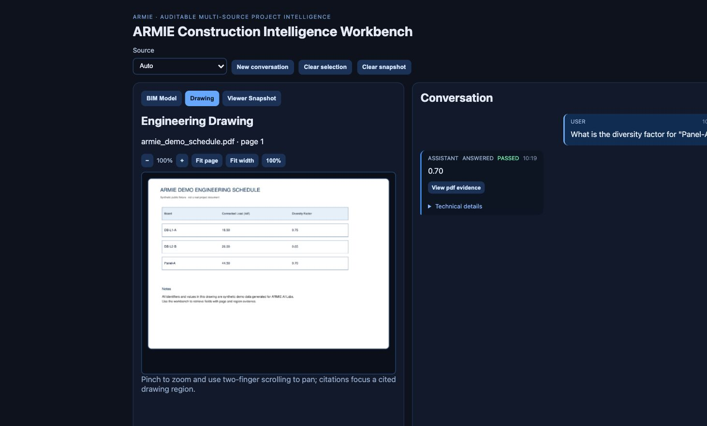
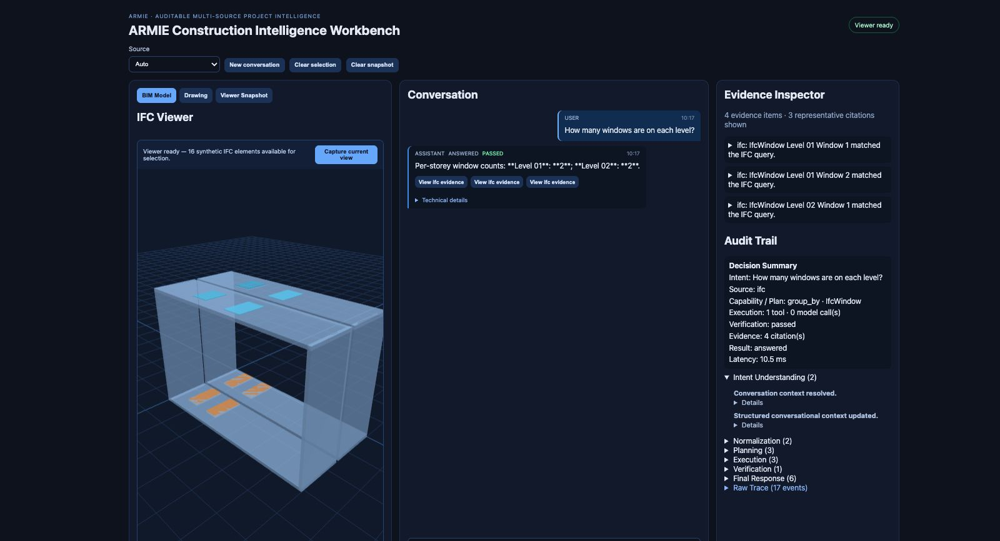

# ARMIE Construction Intelligence Workbench

An auditable multimodal AI reference system for querying BIM models, engineering drawings, and viewer snapshots using typed planning, controlled execution, evidence, verification, and auditability.

This is an independent ARMIE AI Labs reference implementation. It is not a production SaaS, compliance engine, unrestricted BIM reasoning system, or multi-tenant platform.



*Public synthetic demo: interactive BIM viewer, conversational workspace, Evidence Inspector, and audit surface in one workbench.*

## Why this exists

Construction information is fragmented across BIM models, drawings, schedules, screenshots, and structured engineering data. A chat-only system can hallucinate facts and hide how an answer was produced. This workbench keeps natural language as the interaction layer while deterministic domain tools remain the factual execution layer.

## Architecture



LLMs interpret intent and help construct bounded plans. Python and IfcOpenShell calculate engineering facts. Visual models interpret drawing or viewer pixels, but do not replace structured IFC computation.

## Design principles

- One typed `QueryPlan` contract for heuristic and semantic planning.
- Capability gates reject unsupported operations before tools run.
- Deterministic IFC counts, grouping, and bounded quantity aggregation.
- Evidence-first answers with source, page, region, or IFC identity.
- Independent verification rather than trusting the answer generator.
- Honest clarification and unsupported dispositions.
- Request IDs, deadlines, cancellation, and grouped execution auditability.

| Responsibility | System |
|---|---|
| Natural-language interpretation | Rules plus bounded LLM |
| Query planning | Deterministic parser plus Qwen text planner |
| IFC fact computation | IfcOpenShell and Python |
| Drawing interpretation | Deterministic row/column extraction first; Qwen vision model through Ollama as bounded fallback |
| Evidence construction | Application runtime |
| Verification | Deterministic and independent validation |
| Final presentation | React workbench |

## Public demo workspace

The repository includes only synthetic assets in `demo_data/`:

- `armie_demo.ifc`: two-level BIM fixture with walls, doors, windows, storey containment, and controlled heights.
- `armie_demo_schedule.pdf`: synthetic engineering schedule. Page 1 lists fictional electrical identifiers such as `DB-L1-A`, `DB-L2-B`, and `Panel-A`. Page 2 is a door/window schedule keyed on each element's `Tag` (`D01`-`D04`, `W01`-`W05`), used by the cross-source reconciliation pilot.

The UI has three source modes: BIM Model, Engineering Drawing, and Viewer Snapshot. Evidence Inspector and Audit Trail show how each answer was produced.

## Visual walkthrough

The following screenshots were captured locally from the synthetic public fixtures in `demo_data/`.



*A typed IFC query returns a data-derived result with element citations and independent verification.*



*The drawing workflow routes a synthetic schedule question to document analysis and keeps the source page visible alongside the answer.*



*Grouped execution stages make planning, tool execution, evidence, verification, and the final disposition inspectable.*

## Supported capabilities

- Project and per-level door/window counts.
- Grouped counts by storey and bounded maximum-height aggregation for doors/windows.
- Synthetic schedule field lookup for connected load and diversity factor, resolved deterministically from the document's own text layer first, with vision as a bounded fallback (see "Known limitations" for the generality caveat).
- Current-view screenshot inspection with honest target visibility handling.
- Short-term conversational context, clarification, unsupported-operation handling, citations, and independent verification.
- Narrow, explicitly scoped IFC<->drawing cross-source reconciliation: door and window quantities checked against a drawing schedule, joined on each element's `Tag`, reporting per-item matches, dimension mismatches, and omissions on either side (see "Known limitations" for what remains out of scope).

The active release supports one IFC, one PDF, and one local project workspace. Multi-project registries, arbitrary property languages, nearest-room search, compliance reasoning, and autonomous geometry exploration are future work. Cross-source reconciliation exists only for the one door/window case described above; every other cross-source request is still declined by design.

## Local setup

Requirements: Python 3.9+, Node.js 18+, a modern browser, and Ollama with enough memory for the local models.

```bash
cp .env.example .env
ollama pull qwen3:8b
ollama pull qwen3-vl:8b

python3 -m venv .venv
source .venv/bin/activate
pip install -e 'apps/api[dev]'

PYTHONPATH=apps/api python3 -m uvicorn app.main:app --host 127.0.0.1 --port 8000
```

In another terminal:

```bash
cd apps/web
npm install
npm run dev
```

Use `npm ci` instead of `npm install` for a reproducible install from the committed lockfile (this is what CI runs; both work with no flags -- see `docs/decisions/README.md` D-006). Open the URL printed by Vite, normally `http://127.0.0.1:5173`. Vite may select the next free port when that port is occupied.

`./scripts/dev.sh` starts both servers together and stops both on Ctrl+C.

## Demo questions

1. `How many doors are in the model?`
2. `How many windows are on each level?`
3. `Which level contains the most windows?`
4. `Find the tallest door.`
5. `What is the diversity factor for Panel-A?`
6. `What is the connected load for DB-L1-A?`
7. Capture a viewer snapshot and ask: `Is the target element clearly visible?`
8. `Verify the door schedule against the IFC model.`

## Evaluation

```bash
PYTHONPATH=apps/api python3 -m pytest -q
cd apps/web && npm run build
```

167 tests run against the public synthetic fixture: 2 IFC fixture tests (`test_public_workspace.py`), deterministic contract tests for the router/plan-validation/verification modules, 12 provider failure-path evals (F1-F12) driven by a fake, no-network provider, CJK/multilingual characterization tests, provider-seam-invariance tests, deterministic document-extraction tests covering every board/field combination in the fixture plus its ambiguity and vision-fallback paths (`test_pdf_deterministic_extraction.py`), an explicit disposition-taxonomy contract suite (`test_disposition_contract.py`), and the cross-source reconciliation pilot's ground truth, detector precision, and fixture-isolation tests (`test_reconciliation.py`). CI runs the full suite on Python 3.9-3.12 (`.github/workflows/ci.yml`); see `docs/specs/SPEC-M1-reliability-foundation-v1.md`, `docs/specs/SPEC-M2P1-deterministic-document-extraction-v1.md`, `docs/specs/SPEC-M1.5-disposition-contract-v1.md`, and `docs/specs/SPEC-M2-cross-source-reconciliation-pilot-v1.md` for the full test inventory. Browser acceptance should be run against the local API and Vite server; no private-data traces are required or included.

## Privacy and data

This public repository contains no original recruitment, customer, or proprietary project data. Demo assets are synthetic and generated by `scripts/generate_demo_data.py`. Do not add supplied IFC/PDF files, evidence crops, screenshots, model caches, runtime traces, secrets, or private paths.

## Known limitations

- Validated demo language is English; multilingual/noisy input is experimental.
- The IFC query surface is intentionally bounded, not an unrestricted property language.
- Visual conclusions depend on the captured view and may require clarification.
- Document field lookup is deterministic-first, with vision as a genuine fallback rather than the primary path; vision is slower and used only when deterministic extraction fails or is ambiguous.
- The deterministic document extractor uses tolerance-based row/column clustering characterized against the committed synthetic schedule's layout. This is **not** a general table-extraction capability: it is not claimed to work on an arbitrary drawing, a multi-page document, a scanned/OCR-required document, or a ruled-line table. A different document layout needs its own characterization before this path can be trusted on it.
- Cross-source reconciliation is limited to one explicitly scoped case (door/window quantities against a drawing schedule); no general IFC/PDF cross-source join capability or compliance engine.
- No multi-tenancy, enterprise SLOs, or large-scale throughput claim.
- No autonomous camera planning or arbitrary geometry reasoning.

## Roadmap

Project Source Registry, multiple IFC/PDF sources, stronger document routing, hybrid BIM/document reasoning, a construction ontology, larger public evaluation fixtures, and production inference benchmarking.

## ARMIE AI Labs

ARMIE AI Labs · AI Systems Architecture · Retrieval · Agents · Evaluation · Production AI

https://armieai.com/
